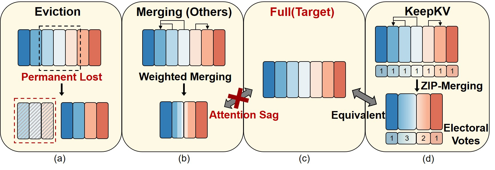

# KeepKV

## Overview



## Setup Environment

We recommend using Anaconda to create a new environment and install the required packages. After activating your environment, run:

```
pip install -r requirements.txt
```

Or install step by step:

```
pip install boto3==1.7.84
pip install crfm-helm==0.2.3
pip install transformers==4.33
```

## Quick Start

- `scripts/helm/` directory contains example scripts; you can add your own script files there.

  - `scripts/helm/full.sh` (no compression, full KV cache)
  - `scripts/helm/h2o.sh` （(H2O algorithm)
  - `scripts/helm/local.sh`(keeps only the most recent KV cache)

- Run one of the scripts; by default, the generated results are saved under `/output`.

- Arguments:
  - task : `xsum` or `cnndm`
  - model : Hugging Face model to load (default: `huggyllama/llama-7b`) 
  - model_arch : model architecture (default: `llama`)
  - For more arguments, see the definitions in `run_helm.py`

- Example command to run the H2O experiment:

```
bash scripts/helm/h2o.sh xsum huggyllama/llama-7b llama
```

- To evaluate the results, change into the `helm` directory with `cd ./helm` and run `./our_run.sh`, which contains:

```
jsonl=../output/xsum-llama-full.jsonl 
task=xsum                   
model_arch=llama            
output_name=xsum-llama-full 

python scripts/offline_eval/import_results.py together ${jsonl} --cache-dir prod_env/cache 

helm-run --conf src/helm/benchmark/presentation/${task}/run_specs_${model_arch}.conf --local --max-eval-instances 1000 --num-train-trials=1 --suite ${output_name} -n 1

helm-summarize --suite ${output_name}
```

Make sure to update the `jsonl` variable to the path of the result file generated in the previous step.
